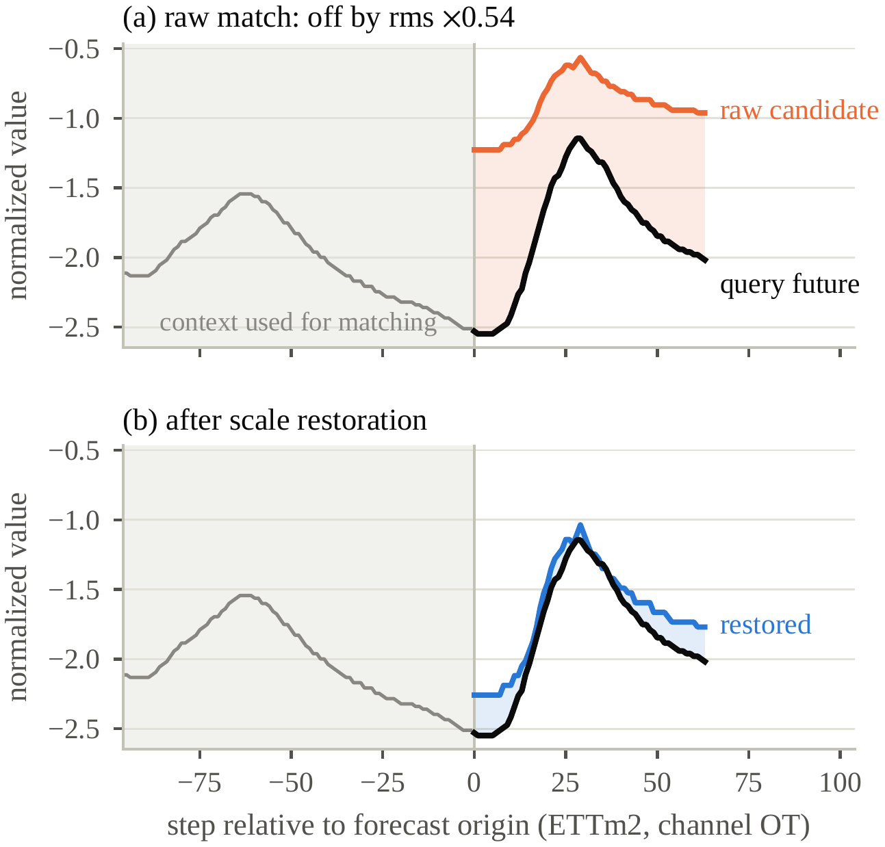
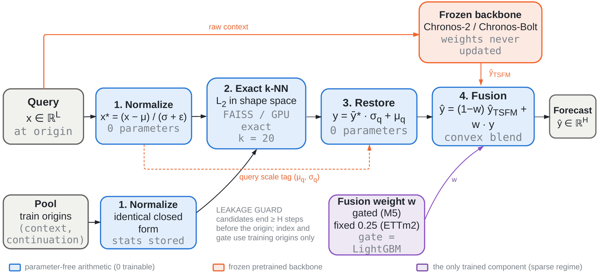
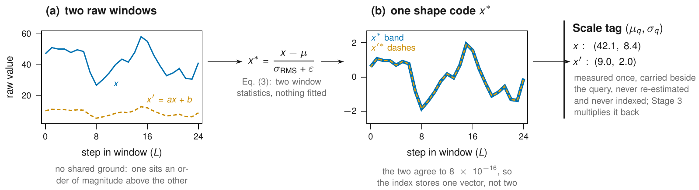
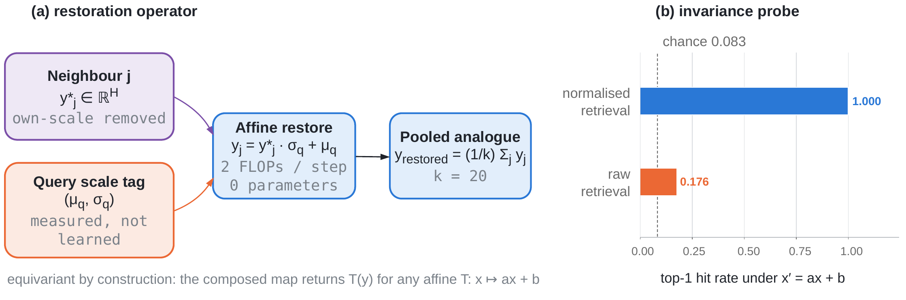
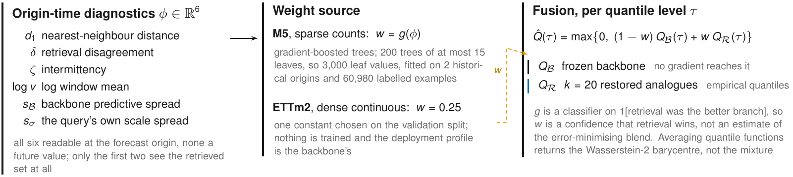
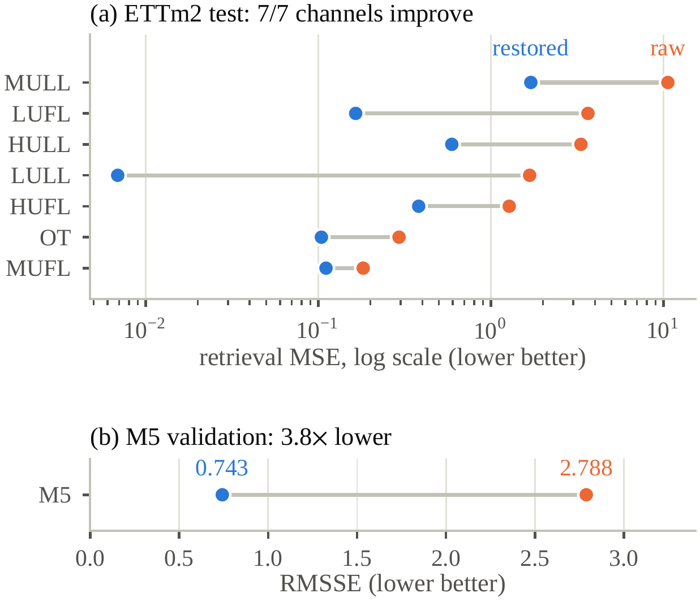
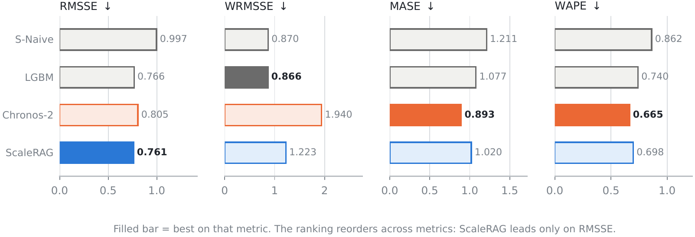
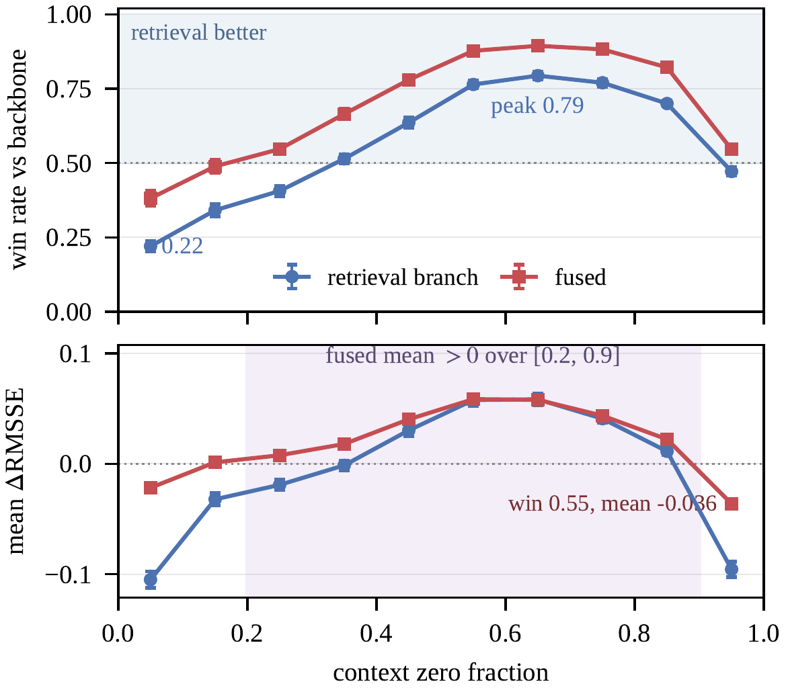
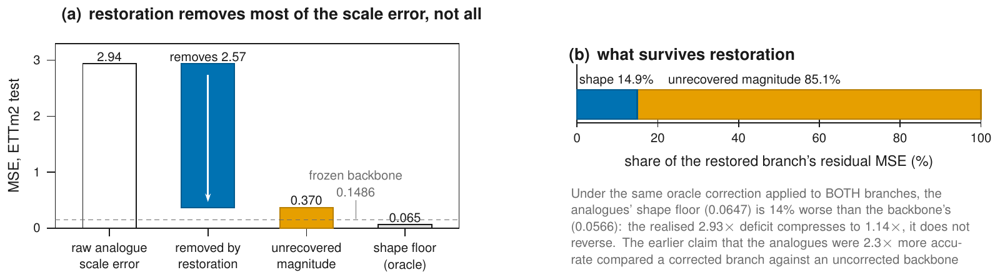
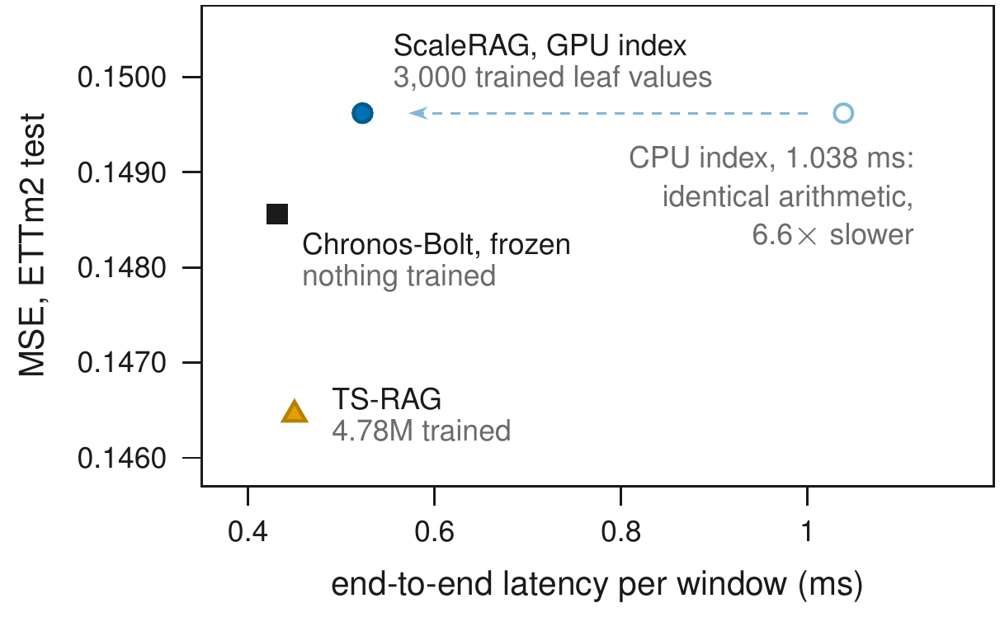

# ScaleRAG

**Scale-Aware Retrieval Augmentation for Time-Series Foundation Models.**

A frozen time-series foundation model is augmented with a retrieval branch whose
**first three stages add no trainable parameters**. Nearest neighbours are matched
in a normalized shape space, their continuations are restored to the query's own
scale in closed form, and the result is blended with the backbone's forecast.

That blend weight is where the parameter count lives. On dense data it is a
constant and the pipeline really is parameter-free end to end; on sparse
intermittent panels it comes from a gradient-boosted gate of 3,000 leaf values.
Calling the whole system parameter-free would be an overclaim, so we don't.

This repository is the code and the full result set behind a study that asks a
narrower question than most retrieval papers: **when does retrieval actually
help a frozen backbone, and when does it not?** The answer is reported here in
full, including the parts that did not work.

> **Headline, stated honestly.** On the held-out M5 panel ScaleRAG beats its
> frozen Chronos-2 backbone by **5.49% RMSSE**, exceeds a tuned LightGBM by only
> **0.69%**, **loses** the competition's own WRMSSE metric, and meets **none of
> three pre-registered success criteria**. On dense ETTm2 it is **0.71% worse**
> than the backbone it augments. The mechanism works — retrieval quality
> improves by 85.5% — but that gain does not become a forecasting gain outside a
> narrow regime. Locating why is the contribution.

---

## Contents

- [The problem: catastrophic scale mismatch](#the-problem-catastrophic-scale-mismatch)
- [Method](#method)
- [Install](#install)
- [Quickstart — runs offline, no dataset needed](#quickstart--runs-offline-no-dataset-needed)
- [Results](#results)
- [Diagnostics](#diagnostics)
- [Cost](#cost)
- [Reproducing every number](#reproducing-every-number)
- [Repository layout](#repository-layout)
- [Protocol](#protocol)
- [Citation](#citation)

---

## The problem: catastrophic scale mismatch

A foundation model sees only the context window handed to it at inference time.
Anything older — last quarter's promotion, last year's seasonal shape — is
unreachable. Retrieval is the natural remedy, and nearest-neighbour retrieval on
raw values needs no training at all. It also fails, for one identifiable reason.

Real series differ in magnitude by orders of magnitude, so a Euclidean index over
raw windows ranks candidates **by scale before it ranks them by shape**. Worse,
even after the index is repaired by normalizing the context, the retrieved
continuation is still expressed at the magnitude of the series it came from.

<p align="center">
  
</p>

Panel (a) is a real ETTm2 query and its top-1 Euclidean neighbour. The candidate
tracks the query's future shape almost exactly — and sits at **0.54×** the
query's RMS, so using it as a forecast injects a systematic level error. Panel
(b) is the same continuation after restoration.

The repair is arithmetic the pipeline has already done. With the query's context
statistics `(μ_q, σ_q)`, mapping a normalized continuation back through
`y·σ_q + μ_q` places it on the query's scale exactly — two scalars, no
parameters.

**We claim no novelty for the restoration itself.** Removing and restoring a
level is standard preprocessing, RAFT already restores a location offset, and
RAID normalizes a retrieved trajectory by its own moments before mapping it onto
a target scale. What is unclaimed elsewhere is the composition, and what this
work adds is the measurement of *where it suffices*. See
[docs/literature-verification.md](docs/literature-verification.md) for the
prior-art checks behind that statement.

---

## Method

Three deterministic stages sit between a query and a frozen backbone, followed by
one fusion step. **Stages 1–3 contribute no trainable parameters.** The backbone
is never updated.

<p align="center">
  
</p>

```
(x*, μ_q, σ_q) = N(x)                          # Stage 1  normalize
J              = R_k(x*; P*),  |J| = k         # Stage 2  exact k-NN
y_restored     = S({y*_j}, μ_q, σ_q)           # Stage 3  restore
ŷ_TSFM         = B(x)                          # frozen backbone
ŷ              = (1−w)·ŷ_TSFM + w·y_restored   # Stage 4  fuse
```

Every symbol is observable at the forecast origin. Nothing on the right-hand
side depends on the realised future.

### Stage 1 — Scale-Invariant Context Normalization

<p align="center">
  
</p>

The raw window is split into a **shape code**, which is all the index is allowed
to see, and a **two-scalar scale tag**, which the index never sees and Stage 3
re-applies. Applying the identical closed form to the query and to every pooled
candidate is what turns the retrieval metric into a shape metric.

The full rule subtracts the mean and divides by RMS deviation:

```
x* = (x − μ) / (σ_RMS + ε)          ε = 1e-8
```

This is exactly invariant to any positive affine map `x ↦ ax + b`. **Both
deployed configurations in this study instead use the cheaper scale-only
variant** `x* = x / (x̄ + ε)`, which is invariant to `x ↦ ax` but **not** to a
location shift. On M5 that was chosen against measured alternatives (the full
rule scored 0.8719 RMSSE, an RMS-only divisor 0.7951, against 0.7425). Carrying
it onto near zero-centred ETTm2 was a mistake, and
[Diagnostics](#diagnostics) quantifies what it cost.

### Stage 2 — Exact shape-space retrieval

```
J = argmin Σ ‖q* − c*_i‖²        subject to    t_i + H < τ
```

**The search is exact everywhere.** ETTm2 uses FAISS `IndexFlatL2`; the
30,490-series M5 panel uses a batched GPU implementation of the same exact
search, verified **bit-for-bit identical** to the CPU retriever (maximum absolute
difference `0.0`) before any held-out run — see
[`scripts/verify_gpu_retrieval.py`](scripts/verify_gpu_retrieval.py). No
approximate index such as HNSW is used anywhere, so no reported difference is
attributable to index quantisation.

The constraint `t_i + H < τ` is the **horizon guard**, enforced at pool
construction rather than at query time. A retrieved continuation cannot overlap
the window it predicts. `tests/leakage/` fails if it is violated.

### Stage 3 — Closed-form scale restoration

<p align="center">
  
</p>

```
y_restored = ȳ* · σ_q + μ_q          # 2 FLOPs per horizon step, 0 parameters
```

Because the operator is affine, averaging the `k` neighbours before or after
restoration is identical — which is why the neighbour budget and the restoration
rule can be ablated independently. A neural adapter reaches the same alignment by
learning a projection from a pretraining corpus; here it costs two scalars.

### Stage 4 — Diagnostic-gated fusion

<p align="center">
  
</p>

On dense data `w` is a constant chosen on validation (`w = 0.25`) and the whole
pipeline stays parameter-free. On sparse intermittent panels the value of
retrieval varies sharply across series, so `w = g(φ)` is predicted per series and
per origin from six origin-time diagnostics: nearest-neighbour distance,
retrieval disagreement, intermittency, log-volume, backbone predictive spread,
and query scale spread.

**As deployed, the gate is a classifier, not a regressor.** It is a LightGBM
classifier trained on the binary label "did the retrieval branch beat the
backbone at this origin", and the weight is its `predict_proba`. Earlier
descriptions of it as a least-squares fit onto an oracle weight do not match the
code; this is one of the defects our own
[code-versus-text audit](docs/code-versus-text-audit.md) found. It is 200 trees
× 15 leaves × 3 seeds = **3,000 leaf values**, and the three seeds are
byte-identical because `subsample` and `colsample_bytree` are both 1.0, so **seed
averaging is not offered as robustness**.

Two further honesties about the feature set, from the same audit: only **two of
the six** features see the retrieved set at all, and `scale_spread` is the
*query's own* coefficient of variation rather than the neighbours'.

**The gate is the only trained component anywhere in the system**, it is trained
on historical origins only, and it is counted as trainable rather than described
away.

---

## Install

Requires Python 3.11 and [`uv`](https://docs.astral.sh/uv/). A CUDA GPU is
optional — everything except the backbone runs on CPU.

```bash
git clone https://github.com/Nidan73/ScaleRAG.git
cd ScaleRAG
uv sync --extra ml --extra retrieval --extra tsfm --extra viz
```

`torch` resolves from the CUDA 13.0 index pinned in `pyproject.toml`, matching
the RTX 5070 Ti (Blackwell, sm_120) this study ran on. Change the index in
`[[tool.uv.index]]` for a different accelerator, or drop `--extra ml` for a
CPU-only install.

---

## Quickstart — runs offline, no dataset needed

M5, Favorita and ETTm2 are all externally licensed and **none of them is
redistributed here**. The pipeline ships a deterministic synthetic fixture so the
whole path is runnable without downloading anything:

```bash
# 1) build + ingest the offline synthetic M5 fixture (idempotent)
uv run python scripts/make_synthetic.py --days 1941 \
      --raw data/raw_synth --processed data/processed

# 2) verify chronological-split integrity before anything else runs
uv run python scripts/leakage_audit.py --spec configs/split_check_val.json

# 3) classical baselines — declare first, then run
uv run python scripts/baseline_run.py --config configs/baseline_seasonal_naive.yaml --dry-run
uv run python scripts/baseline_run.py --config configs/baseline_seasonal_naive.yaml --confirm

# 4) the fast gate: format + lint + types + unit + leakage
make check
```

Real data uses the identical code path — point a config's `processed_dir` at the
ingested panel. Download links for all three datasets are in
[docs/method.md](docs/method.md).

```python
from scalerag.retrieval import WindowDatabase
from scalerag.native import NativeScaleRetriever, fixed_fusion
```

---

## Results

### Ablation — restoration is what makes retrieval usable

<p align="center">
  
</p>

Removing restoration from an otherwise identical retriever destroys it. Retriever,
index, normalization and neighbour budget are unchanged across each row, so the
difference is attributable to the restoration step alone.

| Dataset | Metric ↓ | Raw | Restored | Improvement |
|---|---|---:|---:|---|
| M5 (1k, validation) | RMSSE | 2.7884 | **0.7425** | 73.4% (3.8×) |
| ETTm2 (test, n=80,199) | MSE | 3.0024 | **0.4348** | 85.5% &nbsp;`CI [85.3, 85.7]` |

All **7 of 7** ETTm2 channels improve, so no single series carries the aggregate.

### Held-out M5 — the honest table

`d_1914`–`d_1941`, all 30,490 series, **single locked run**. The split was frozen
before any result was seen and opened exactly once.

| Method | RMSSE ↓ | WRMSSE ↓ | MASE ↓ | WAPE ↓ | Cov.80 |
|---|---:|---:|---:|---:|---:|
| Seasonal-Naive | 0.9972 | 0.8697 | 1.211 | 0.862 | 0.458 |
| Recent-mean | 0.7669 | 1.0876 | 1.074 | 0.745 | n/a |
| LightGBM | 0.7665 | **0.8663** | 1.077 | 0.740 | n/a |
| Chronos-2 (frozen) | 0.8054 | 1.9395 | **0.893** | **0.665** | **0.786** |
| **ScaleRAG (gated)** | **0.7612** | 1.2231 | 1.020 | 0.698 | 0.698 |

<p align="center">
  
</p>

**ScaleRAG leads on RMSSE and loses every other metric in the table.** That
reordering, not a leaderboard position, is the empirical result:

- vs. frozen Chronos-2: **+5.49% RMSSE**, 95% CI `[5.40, 5.59]` — real, excludes zero.
- vs. tuned LightGBM: **+0.69%**, CI `[0.57, 0.82]` — significant at 30,490 series, and operationally negligible.
- On **WRMSSE**, the dollar-weighted metric that defines M5, even Seasonal-Naive (0.8697) beats us (1.2231).
- The backbone is better on MASE, WAPE, MAE (0.960 vs 1.008), pinball (0.289 vs 0.298), and calibration — it attains 0.786 coverage at a nominal 80% where the gated fusion under-covers at 0.698.

#### Where the gain comes from

Every row below is from that same locked run.

| Configuration | RMSSE ↓ | Δ vs previous | Δ vs backbone |
|---|---:|---:|---:|
| Seasonal-Naive (floor) | 0.9972 | — | −23.8% |
| + frozen backbone only | 0.8054 | −0.1918 | — |
| + stages 1–3, no blend | 0.7795 | −0.0259 | +3.22% |
| + stage 4, fixed `w = 0.5` | 0.7692 | −0.0103 | +4.49% |
| + stage 4 gate (full ScaleRAG) | **0.7612** | −0.0080 | **+5.49%** |
| *reference:* tuned LightGBM | 0.7665 | — | +4.83% |

Roughly **four fifths of the retrieval gain is already available from the
parameter-free stages under a constant weight**; the learned gate is worth the
remaining ~1.0 percentage point. That is a weaker case for the learned component
than a comparison against the backbone alone would suggest, and it is reported
here rather than left out.

### Pre-registered criteria — 0 of 3 met

Fixed before the split was opened, reported unchanged.

Stated in the registered wording, not paraphrased — the method had to meet **at
least one** of the three:

| # | Criterion, as registered | Observed | Met |
|---|---|---|:--:|
| 1 | ≥3% relative RMSSE/WRMSSE improvement over the strongest matched baseline, 95% CI excluding zero | **0.69%** over LightGBM, CI [0.57, 0.82] — interval excludes zero, margin does not clear 3% | ❌ |
| 2 | ≥5% over target-only Chronos-2 on **both** M5 and Favorita | M5 **+5.49%** clears the bar; Favorita **+0.83%** does not, so the conjunct fails | ❌ |
| 3 | ≥7% on predefined sparse / intermittent / low-volume / reduced-history slices, without materially degrading overall | best qualifying slice **+0.93%** (reduced-history); intermittent −0.03%, low-volume −0.30%. The only slice above 5% is *dense* (+5.04%), which the criterion did not target | ❌ |

**0 of 3.** Criterion 2 is worth reading closely: M5 alone would have passed it.
The registration required both panels, and Favorita is where the method's
regime dependence shows.

We report this instead of re-tuning. The split was consumed exactly once by
design, and any post-hoc adjustment would invalidate it.

### ETTm2 — the dense regime, where the method loses

n = 80,199 windows. ΔMSE is relative to the frozen target-only backbone.

| Method | MSE ↓ | MAE ↓ | ΔMSE | Trainable |
|---|---:|---:|---:|---:|
| Chronos-Bolt (frozen, target-only) | 0.14856 | 0.22354 | — | 0 |
| TS-RAG (official ARM) | **0.14646** | **0.22302** | +1.42% | 4.78M |
| ScaleRAG (restored, fixed fusion) | 0.14962 | 0.24034 | **−0.71%** | **0** |

The degradation is small but statistically significant, CI `[0.14, 1.26]`. The
official TS-RAG adapter beats our fusion by a further **2.16%** MSE (CI
`[1.57, 2.72]`), at the cost
of 4.78M trainable parameters and a pretraining corpus. Our TS-RAG reproduction
matches its published numbers to within **0.10%**, which is the condition under
which we treat it as a fair external comparison.

On Favorita, the third panel, the gain over the backbone is **+0.83%**.

---

## Diagnostics

Three analyses explain the gap between an 85.5% retrieval gain and a 0.71%
end-to-end loss. This is the part of the study that generalises.

### 1. Retrieval utility is not monotone in sparsity

<p align="center">
  
</p>

Read at dataset level the relationship looks monotone — a 0.85% loss on
continuous ETTm2 (−0.71%), 0.83% on Favorita, 0.13% on the dense M5 slice *(not
significant, CI contains zero)*, 5.08% on the full M5 validation panel, 5.63% on
its most intermittent slice.

**That reading is wrong at the sparse end.** Measured per series over ~1,000
series at each of **50 non-overlapping forecast origins**, the win rate forms an
inverted U:

| Context zero fraction | Win rate (mean ± SEM over 50 origins) |
|---|---:|
| 0.0–0.1 (densest) | 0.220 ± 0.009 |
| 0.6–0.7 (peak) | **0.794 ± 0.006** |
| 0.9–1.0 (sparsest) | 0.472 ± 0.007 |

The peak clears both extremes with **non-overlapping 95% intervals**, so this is
not a sampling artefact. Refitting an isotonic crossing at each origin separately
places the branch's crossing at a zero fraction of **[0.33 ± 0.05, 0.95 ± 0.02]** —
the lower edge found at all 50 origins, the upper at 48.

**The advantage is smaller than the raw win rate suggests, and it survives.** The
0.794 above compares the retrieval branch against an *uncorrected* backbone, so
part of the inverted U is the backbone being mis-levelled rather than retrieval
being good. Under a symmetric oracle that level-corrects **both** sides, 37% of
the amplitude is exactly that, and the mid-band advantage is **0.542**, CI
**[0.528, 0.556]** — narrowed, still clearing a coin flip. A separate test asked
whether the whole shape is an artefact of the scale operator and **rejected that
explanation**: the inverted U appears under all three normalisation rules
([docs/m5-sparse-scale-rule-report.md](docs/m5-sparse-scale-rule-report.md)).

Retrieval fails at both ends for different reasons: a dense series leaves the
backbone little to gain from an analogue, while a near-empty one offers too
little structure for any analogue to match. **Dataset-level averages and a linear
coefficient cannot express this shape**, which is the likeliest reason it has not
been reported before.

> **For a practitioner the band is the operative result, not the method.** Route
> on a **positive mean effect**, not on the win rate: fused retrieval raises the
> win rate in all ten bins, but in the sparsest bin it wins 54.6% of series while
> its *mean* effect is −0.036 — a win-rate rule would route into a bin that loses
> on average. The recommended routing band is therefore a zero fraction of
> **[0.2, 0.9]**, which is a different and stricter criterion than the branch's
> [0.33, 0.95] crossing above. Outside it, non-neural retrieval augmentation of a
> frozen backbone is unlikely to repay its index cost — decidable from one
> statistic per series, before any model is built.

### 2. The residual error is magnitude, not shape

<p align="center">
  
</p>

Fitting the per-window least-squares affine correction to the realised future
gives a **shape floor** — a lower bound, so whatever survives it is the analogue
genuinely having the wrong shape.

- Restoration removes **2.57** of the **2.94** MSE of scale error, but the remaining **0.370** is 5.7× the retrieval shape floor and 2.5× the backbone's entire error.
- The split: **14.9% shape, 85.1% unrecovered magnitude.** This is internal to the retrieval branch (0.0647 ÷ 0.4348) and involves no comparison with the backbone.

> **Retracted claim — read this if you have seen an earlier version.** This
> section used to say that, optimally rescaled, the analogues would be *2.3×
> more accurate than the backbone*. **That was wrong, and its direction
> reverses.** It compared an oracle-corrected retrieval branch against an
> *uncorrected* backbone — granting one side two free parameters fitted on the
> realised future and the other side none. Under the identical correction the
> backbone's shape floor is **0.0566** against retrieval's **0.0647**: the
> analogues are about **14.3% worse** at shape, not better. Paired bootstrap
> −0.0080, CI95 [−0.0083, −0.0077], excluding zero; retrieval's shape floor
> beats the backbone's in only **29.5%** of windows.

The defensible statement is a **compression, not a superiority claim**: the
retrieval branch's realised deficit of **2.93×** against the backbone collapses
to **1.14×** once both sides receive the same oracle correction. A 193% deficit
that becomes 14% under pure affine alignment localises the bottleneck in
magnitude — symmetrically, and falsifiably.

A practitioner reading only an aggregate MSE would conclude retrieval does not
work on ETTm2. Reading the decomposition, the correct conclusion is that the
analogues are close to the backbone in shape and the two-scalar correction is
what fails. Those two diagnoses imply opposite next experiments.

### 3. Invariance and equivariance, measured rather than asserted

<p align="center">
  
</p>

Normalization is routinely *described* as making retrieval scale-invariant. Under
a controlled affine transform `x' = ax + b` on synthetic queries with known
ground-truth matches:

| Retrieval space | Top-1 hit rate |
|---|---:|
| Normalized (full rule) | **1.000** |
| Raw | 0.176 |
| *chance* | *0.083* |

The invariance is not approximate and not statistical — it is an arithmetic
identity confirmed numerically, and restoration is **exactly equivariant**
(error constant to 8.7e-19 across the grid).

**The probe also bounds the claim, which is why it is diagnostic rather than
promotional.** The scale-only variant that both deployed configurations actually
use passes the multiplicative test and **fails the additive one** — a 291×
degradation in reconstruction error from an offset alone. That is precisely the
property whose absence costs 85.1% on near-zero-centred ETTm2. The probe
*predicts* the ETTm2 failure rather than rationalising it after the fact.

The implied repair — a location-aware scale rule — is
[**pre-registered and deliberately not executed**](docs/znorm-preregistration.md).
Choosing a scale rule after inspecting this attribution would be tuning on
evaluation data.

---

## Cost

Measured on one machine, batch 256, warm-up excluded.

| Component | Trainable | Latency / window | Storage |
|---|---:|---:|---:|
| Chronos-Bolt (frozen) | 0 (205.3M) | 0.431 ms (GPU) | — |
| TS-RAG ARM (official) | 4.78M | 0.450 ms (GPU) | 1,528.6 MB |
| ScaleRAG retrieval | **0** | 0.607 ms (CPU) → **0.09 ms (GPU)** | 1,096.2 MB |
| ScaleRAG total | **0** | 1.038 ms (CPU) → **0.523 ms (GPU)** | 1,096.2 MB |

<p align="center">
  
</p>

**The comparison is now same-device, and the conclusion holds.** The original
1.038 ms put a CPU index against a GPU adapter, which is not a fair contest. On
one device the index runs **0.486 ms CPU vs 0.073 ms GPU, a 6.6× speedup**,
returning bit-identical candidates (n = 4,096). Scaling to the full pool puts
ScaleRAG at ≈**0.523 ms** against the adapter's 0.450 ms.

**On ETTm2 we remain Pareto-dominated** — slower *and* less accurate — but by
**16%** on latency, not the 131% the CPU figure implied. The exact search that
removes confounds from every ablation is also what sets this cost floor. The
configuration is attractive where a neural adapter cannot be trained at all, not
where it can.

Storage is stated two ways deliberately: 1,096.2 MB is the float64 candidate
matrix; the searched index is float32, i.e. **548.1 MB**. Both are given so the
cost claim can be restated on whichever one a reader means.

---

## Reproducing every number

Each script regenerates a specific artifact. All write machine-readable JSON.

| Script | Reproduces |
|---|---|
| `scripts/make_synthetic.py` | offline M5 fixture (no download) |
| `scripts/leakage_audit.py` | chronological-split integrity report |
| `scripts/baseline_run.py` | Seasonal-Naive / LightGBM baselines |
| `scripts/retrieval_eval.py` | Phase-5 retrieval design sweep |
| `scripts/scalerag_matrix.py` | full M5 ablation matrix → `docs/ablation-report.md` |
| `scripts/scalerag_eval.py` | M5 gated-fusion evaluation |
| `scripts/scalerag_favorita.py` | Favorita cross-dataset check |
| `scripts/scalerag_test_final.py` | the locked held-out M5 run *(refuses while the consumption lock exists)* |
| `scripts/regime_threshold_run.py` | the 50-origin inverted U → `docs/regime-threshold-report.md` |
| `scripts/affine_probe_run.py` | invariance/equivariance probe → `docs/affine-probe-report.md` |
| `scripts/error_decomposition_run.py` | shape/magnitude split → `docs/retrieval-forecasting-gap.md` |
| `scripts/gate_transfer_run.py` | cross-dataset gate transfer → `docs/gate-transfer-report.md` |
| `scripts/scalerag_native_ettm2.py` | ETTm2 adapter → `docs/scalerag-native-dev-report.md` |
| `scripts/verify_gpu_retrieval.py` | GPU ≡ CPU retrieval, bit-for-bit |
| `scripts/ettm2_znorm_selection_run.py` | Eq. (3) vs Eq. (4) on ETTm2 validation → `docs/ettm2-scale-operator-selection.md` |
| `scripts/m5_sparse_scale_rule_run.py` | sparse-bin behaviour under all three rules → `docs/m5-sparse-scale-rule-report.md` |
| `scripts/m5_incontext_baseline_run.py` | in-context conditioning vs the convex blend → `docs/incontext-baseline-report.md` |
| `scripts/fusion_calibration_run.py` | what the fused predictive law actually is → `docs/fusion-calibration-report.md` |
| `scripts/scale_identifiability_run.py` | sparse-end scale identifiability → `docs/scale-identifiability-report.md` |
| `scripts/wrmsse_attribution_run.py` | where the WRMSSE loss comes from → `docs/wrmsse-attribution-report.md` |
| `scripts/m5_ksweep_gate_run.py` | k sweep beyond 20, gate out-of-origin validation |
| `scripts/ettm2_cost_run.py` | same-device CPU/GPU index cost |
| `scripts/make_paper_figures.py` | the earlier matplotlib figure set, superseded by the TikZ sources |
| `scripts/make_phase11a_figures.py` | the Phase-11A figure set |

**On the figures.** Every *number* in every figure above is regenerated by the
scripts in this table, which write the JSON in `docs/`. The figure files
themselves are rendered from those values; the rendering sources are not part of
this repository.

**Curated results** live in `docs/` and are tracked. `reports/` is regenerable
and gitignored. The tables above are machine-readable in
[`docs/scalerag-heldout-test-tables.json`](docs/scalerag-heldout-test-tables.json)
and [`docs/scalerag-native-dev-results.json`](docs/scalerag-native-dev-results.json).

---

## Repository layout

```
src/scalerag/
  retrieval.py  retrieval_faiss.py  retrieval_gpu.py   exact k-NN, three backends
  retrieval_forecast.py                                continuations → forecast
  fusion.py                                            convex blend + paired bootstrap
  native.py                                            dense-panel adapter (ETTm2)
  tsfm/chronos2.py                                     frozen backbone wrapper
  affine_probe.py  error_decomposition.py  regime.py   the three diagnostics
  scale_operators.py                                   the normalisation rules + identifiability
  sparse_regime.py                                     per-bin profiling on intermittent panels
  leakage.py  splits.py                                horizon guard, chronological splits
  metrics.py  hierarchy.py                             RMSSE / WRMSSE / MASE / WAPE / pinball
  features.py  baselines/                              LightGBM + Seasonal-Naive
  data/                                                M5 schema, ingest, synthetic fixture
  config.py  reproducibility.py  eval.py  cli.py       run records, seeding, config schema

tests/
  unit/        16 files    component correctness
  leakage/      9 files    temporal-integrity guards — first-class, not an afterthought
  integration/  1 file     end-to-end baseline evaluation

scripts/   33 entry points, one per reproducible artifact
docs/      curated reports + machine-readable result tables
figures/   every figure in this README
configs/   YAML run definitions, schema-validated with extra="forbid"
```

**186 tests pass.** Every splitting, scaling, retrieval and feature component has a leakage test that
**fails when a temporal violation is deliberately introduced** — asserting the
violation is caught, not merely that normal input passes.

```bash
make check     # format + lint + types + unit + leakage
make test      # everything
```

---

## Protocol

The full set is in [docs/research-rules.md](docs/research-rules.md). The ones
that shaped the results above:

- **Chronological splits only.** Never random, never shuffled.
- **Horizon guard** `candidate_end + H < target_forecast_origin`, enforced at pool construction.
- **Everything fitted is fitted on history only** — scalers, indices, utility labels, the gate.
- **No single-run headline numbers.** Paired-bootstrap CIs over series, 2,000 resamples.
- **The M5 test split was opened exactly once** and is not re-evaluated. The harness refuses while the consumption lock exists.
- **Pre-registered criteria are not edited after the fact**, including when none is met.
- **Negative results are preserved.** The relation-aware graph-routing hypothesis this project started from was falsified across two datasets with non-learned routers, learned routers, controls and confidence intervals. It is reported as a negative rather than quietly dropped.

Known limitations are catalogued in
[docs/threats-to-validity.md](docs/threats-to-validity.md) — including that the
regime profile covers 50 origins on one panel, that the held-out comparison
resamples at a single evaluation origin, and that the scale rule carried onto
ETTm2 was the wrong one.

---

## Citation

A manuscript describing this work is in preparation. Until it is published,
please cite the repository:

```bibtex
@software{scalerag_code,
  title = {ScaleRAG: Scale-Aware Retrieval Augmentation for Time-Series
           Foundation Models -- code and results},
  year  = {2026},
  url   = {https://github.com/Nidan73/ScaleRAG}
}
```

## License

[MIT](LICENSE).

Datasets are **not** redistributed here and remain under their own terms: M5 and
Favorita via their Kaggle competitions, ETTm2 via the ETDataset repository.
Backbone checkpoints are the public Chronos releases from Amazon Science and are
referenced, never vendored.
